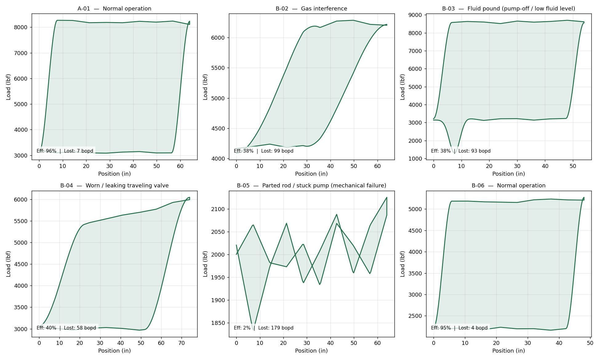
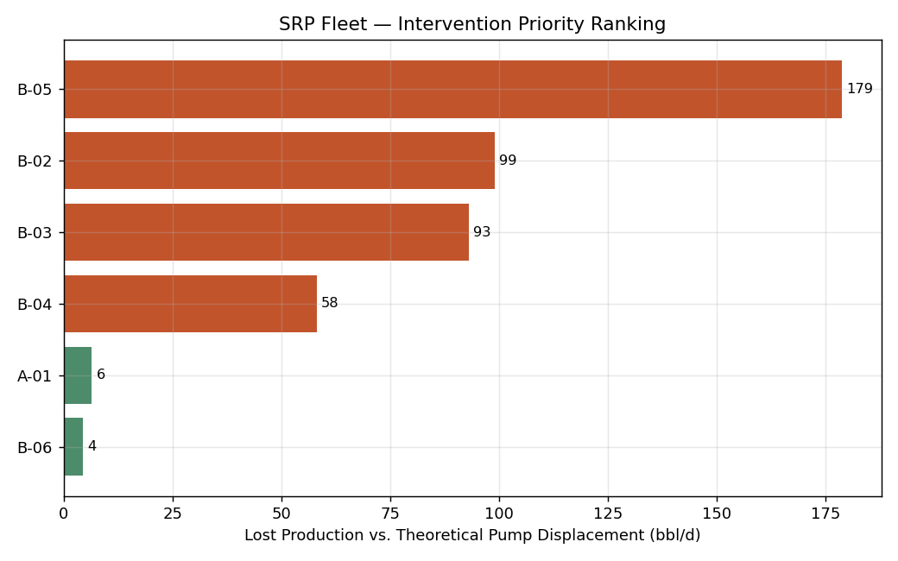

# Sucker Rod Pump (SRP) Diagnostics — Dynamometer Card Analysis & Fleet Surveillance

**Author:** David Damanik
**Project type:** Independent portfolio case study (synthetic field data, real diagnostic methodology)
**Tools:** Python (NumPy, Matplotlib) — dynamometer card modeling, feature extraction, rule-based classification

---

## 1. Problem Statement

Well surveillance teams routinely monitor surface dynamometer cards (polished-rod load vs. position) to catch pump problems before they cause a costly deferred-production event or a failed rod. This project builds a small, fully explainable diagnostic tool that:

1. Extracts quantitative features from a dynamometer card (peak/min load, card area, notch depth, top-edge tilt).
2. Classifies the likely failure mode using a rule-based decision tree calibrated to the classic card-shape signatures taught in artificial-lift surveillance training.
3. Converts the diagnosis into a **production-loss number** (theoretical vs. actual pump displacement), so wells can be ranked by economic priority rather than just flagged as "abnormal."

This directly extends real experience: monitoring two real-time producing SRP wells and evaluating non-pumping/floating-rod cases during the PHR internship. The well **A-01** in this fleet is the same well used in Project 1 (Production Optimization), now shown after conversion to artificial lift once natural flow could no longer sustain economic rates — the two projects tell one continuous field-life story.

## 2. Methodology

### 2.1 Card generation
Five characteristic dynamometer card shapes are generated parametrically: **normal**, **gas interference**, **fluid pound**, **worn/leaking traveling valve**, and **parted rod / stuck pump**. Each reproduces the shape signature described in standard rod-pump surveillance references (rounded/compressed cards for gas interference, a sharp downstroke notch for fluid pound, a tilted top edge for a leaking traveling valve, and a collapsed near-zero-area card for a mechanical failure).

*These are synthetic, stylized cards built to reproduce recognizable shape signatures — not measured field data or a full rod-string wave-equation simulation (see Limitations).*

### 2.2 Feature extraction
For each card:
- **PPRL / MPRL** — peak and minimum polished rod load
- **Area ratio** — card area (shoelace formula) ÷ area of the equivalent full rectangle; a direct proxy for pump fillage/efficiency
- **Top-edge tilt** — slope of the load during the top 65% of the upstroke (flat ≈ 0; a leaking traveling valve produces a diagonal rather than flat top)
- **Notch ratio** — depth of any sharp localized dip on the downstroke relative to the total load range (the fluid-pound signature)

### 2.3 Rule-based classification
A decision tree (not a black-box ML model) assigns the most likely diagnosis:

| Signature | Diagnosis |
|---|---|
| Area ratio < 0.20, load range collapsed | Parted rod / stuck pump |
| Sharp downstroke notch (notch ratio > 0.20) | Fluid pound |
| Diagonal top edge (tilt > 8 lbf/in), reduced area | Worn/leaking traveling valve |
| Compressed, rounded card, no notch/tilt | Gas interference |
| Near-rectangular, high area ratio | Normal |

A rule-based approach is used deliberately: it requires no training data, is fully explainable to a supervisor, and mirrors the manual diagnostic logic taught in well-surveillance courses — important when a recommendation may drive a workover decision.

### 2.4 Production-loss quantification
Theoretical pump displacement is computed from pump design parameters:

```
PD (bbl/d) = 0.1166 × Stroke(in) × SPM × Plunger_diameter(in)²
```

Comparing this to the well's actual (field-measured) rate gives a **volumetric efficiency**, and wells are ranked by absolute lost production (bbl/d) — turning a qualitative "this card looks bad" into a quantified, rankable business case for intervention.

## 3. Results — Fleet Surveillance (6 wells)



The classifier correctly identified the true condition on **6 of 6 wells (100%)** in this synthetic test fleet.

| Well | Diagnosis | Volumetric Efficiency | Lost Production |
|---|---|---|---|
| A-01 | Normal operation | 95.6% | 6.5 bopd |
| B-02 | Gas interference | 38.1% | 99.0 bopd |
| B-03 | Fluid pound | 38.4% | 93.1 bopd |
| B-04 | Worn traveling valve | 40.2% | 58.1 bopd |
| B-05 | Parted rod (mechanical failure) | 2.2% | 178.8 bopd |
| B-06 | Normal operation | 94.9% | 4.5 bopd |

### Intervention Priority Ranking


Ranking by lost production (not just diagnosis category) changes the intervention order in a way that matters commercially: **B-02 (gas interference, 99 bopd lost)** outranks **B-03 (fluid pound, 93 bopd lost)** even though a fluid-pound card looks more dramatic — the ranking is driven by actual deferred barrels, which is what a production manager needs to prioritize workover/rig scheduling against.

**B-05 is the clear top priority** — the card shows a near-total mechanical failure (2.2% efficiency, 179 bopd deferred) and warrants immediate shutdown and rig scheduling rather than routine monitoring.

## 4. Engineering Recommendations

1. **B-05 (parted rod):** Shut in immediately; do not continue running against a failed downhole component. Schedule the next available workover rig.
2. **B-02 (gas interference):** Install/inspect gas anchor and evaluate lowering pump intake below perforations before considering a full workover — this is often correctable without pulling the string.
3. **B-03 (fluid pound):** Reduce SPM/stroke or install a pump-off controller to match pump runtime to reservoir inflow — running a pump faster than the well can feed it is actively damaging the equipment while losing efficiency.
4. **B-04 (worn traveling valve):** Efficiency loss (60%) is high enough to justify a scheduled workover; not urgent like B-05, but should not be deferred indefinitely.
5. **A-01, B-06:** No action — both are within normal efficiency range (>94%); continue routine surveillance.

## 5. Limitations & Next Steps

- Cards are synthetically generated to reproduce recognizable textbook shape signatures, not derived from a rod-string wave-equation model or real SCADA data.
- The rule-based thresholds (e.g. notch ratio > 0.20, tilt > 8 lbf/in) are calibrated against this synthetic generator; deploying against real field cards would require re-calibrating thresholds against labeled historical data, and a larger dataset would justify moving to a trained classifier (e.g. decision tree/CNN on card images) rather than hand-set rules.
- The pump-displacement formula assumes 100% barrel factor and full plunger travel; in practice, rod stretch and tubing movement (over-travel/under-travel) shift effective stroke length at depth — a refinement worth adding if this tool were extended toward deployment.
- **Next step in this portfolio:** Project 3 (Well Intervention Decision Case) picks up directly from this ranking — turning the diagnosis + lost-production numbers into a cost/benefit case for each recommended intervention.

---
*All source code is included in `/src`. Run `python src/run_analysis.py` to regenerate all figures and `outputs/results_summary.json`.*
