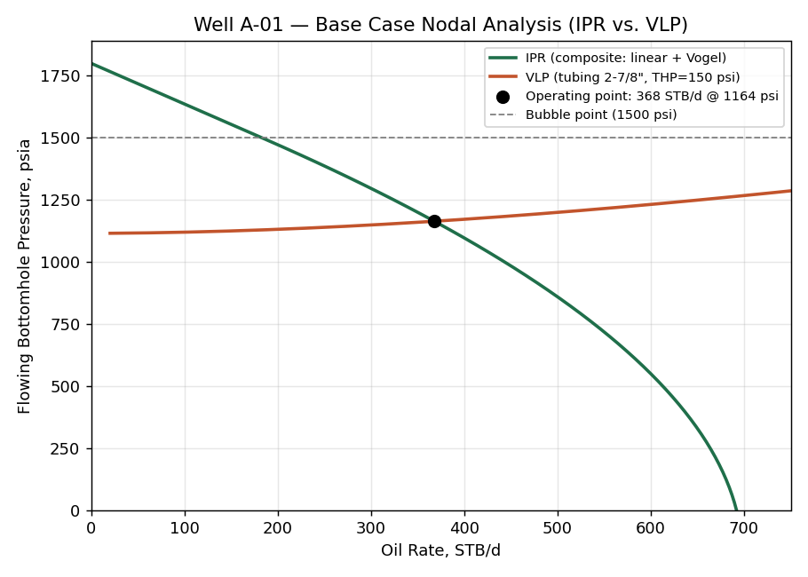
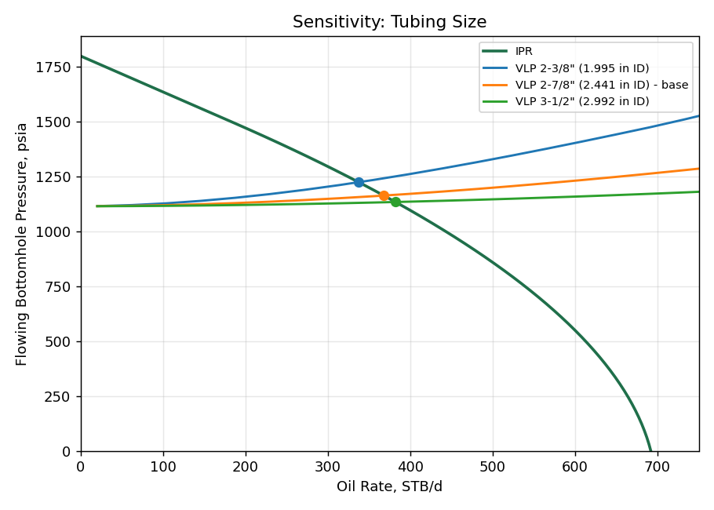
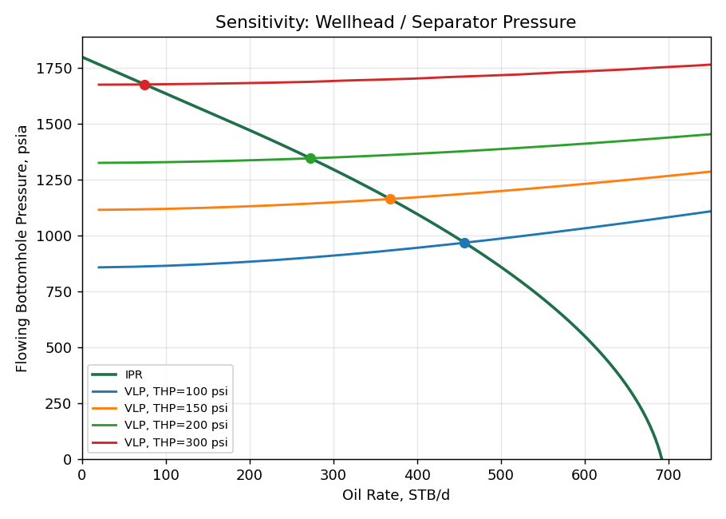
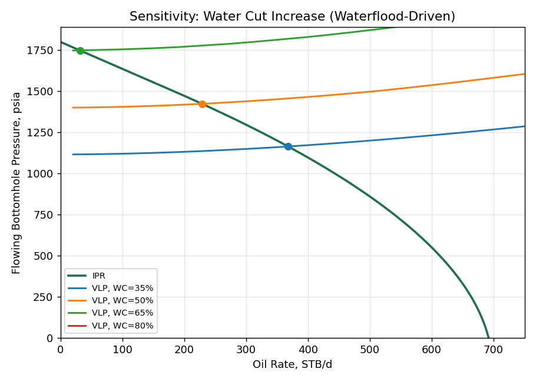
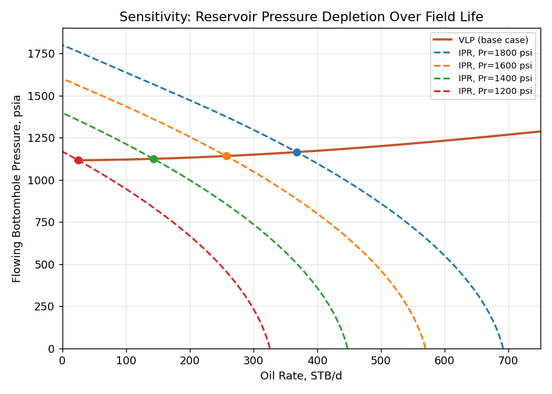

# Production Optimization of a Mature Oil Well Using IPR–VLP Nodal Analysis

**Author:** David Damanik
**Project type:** Independent portfolio case study (synthetic field data, real petroleum engineering methodology)
**Tools:** Python (NumPy, SciPy, Matplotlib) — full black-oil PVT correlations, composite IPR, multiphase VLP, nodal solver

---

## 1. Problem Statement

Well **A-01** is a hypothetical mature, moderately damaged oil well producing under natural flow. Recent surveillance suggests the well may be operating well below its deliverability potential. This study answers three questions a production engineer is routinely expected to answer:

1. What is the well's current operating point, and how far is it from its true potential (AOF)?
2. Which surface and completion variables have the greatest influence on rate — tubing size, wellhead pressure, or water cut?
3. How will deliverability evolve as the reservoir depletes, and at what point does the well require artificial lift?

## 2. Well & Reservoir Data

| Parameter | Value |
|---|---|
| Mid-perforation depth (TVD) | 5,500 ft |
| Tubing (base case) | 2⅞" EUE 6.5#, ID = 2.441 in |
| Reservoir pressure, P_r | 1,800 psia |
| Bubble point, P_b | 1,500 psia |
| Reservoir temperature | 180 °F |
| Wellhead / flowline temperature | 100 °F |
| Oil gravity | 32° API |
| Gas specific gravity | 0.75 |
| Water specific gravity | 1.05 |
| Water cut | 35% |
| Producing GOR (solution GOR at P_b) | 450 scf/STB |
| Wellhead pressure (separator) | 150 psia |
| **Well test:** | P_wf = 1,200 psia → Q_o = 350 STB/d |

*This is a synthetic dataset built to realistic field ranges — it is used to demonstrate methodology, not to represent an actual well.*

## 3. Methodology

### 3.1 Inflow Performance Relationship (IPR)
Because reservoir pressure (1,800 psia) is above bubble point (1,500 psia) but the calibration test point falls below it, a **composite IPR** is used:

- **P_wf ≥ P_b:** linear (Darcy) inflow, `Q_o = J·(P_r − P_wf)`
- **P_wf < P_b:** Vogel's equation, anchored to the linear segment at P_b

The productivity index **J** is back-calculated from the single well test point (P_wf = 1,200 psia, Q_o = 350 STB/d) rather than assumed, which is standard practice when only a single stabilized test is available.

**Result: J = 0.61 STB/d/psi**, giving an absolute open flow potential (AOF) of **≈690 STB/d**.

### 3.2 Vertical Lift Performance (VLP)
A full pressure traverse is computed from wellhead to bottomhole using:

- **PVT:** Standing correlation for solution GOR and oil FVF, Vasquez–Beggs undersaturated oil compressibility, Papay approximation for gas z-factor, Beggs–Robinson oil viscosity, Lee et al. gas viscosity.
- **Multiphase flow:** a homogeneous (no-slip) mixture model — in-situ oil/water/gas volume fractions are computed at each depth step from local pressure and temperature, giving mixture density and viscosity; friction is evaluated with the Moody/Chen friction factor.
- The tubing is discretized into 110 depth increments with a predictor–corrector pressure iteration at each step.

**Modeling note (limitation):** a no-slip homogeneous model is a simplification relative to full mechanistic/empirical multiphase correlations (e.g. Hagedorn–Brown, Duns–Ros) that account for liquid holdup and slip between phases, and it does not capture flow-regime effects like liquid loading at very low rates. It captures the correct first-order physics (gravity- vs. friction-dominated pressure drop, gas breakout below P_b) and is standard for a screening-level nodal analysis; a slip correlation would be the natural next refinement.

### 3.3 Nodal Analysis
The operating point is the rate at which the IPR outflow pressure equals the VLP inflow pressure requirement, solved numerically (Brent's method) at the bottomhole node.

## 4. Base Case Results

| | |
|---|---|
| **Operating point** | **Q_o = 368 STB/d @ P_wf = 1,164 psia** |
| Well test point (calibration) | 350 STB/d @ 1,200 psia |
| AOF (theoretical max, P_wf = 0) | ≈690 STB/d |

The well is currently producing close to its natural-flow potential under present conditions — there is no large "low-hanging fruit" gap at the current reservoir pressure and water cut. The more important question is how that changes going forward, addressed in the sensitivity cases below.

## 5. Sensitivity Analysis

### 5.1 Tubing Size

| Tubing | Operating rate |
|---|---|
| 2⅜" (1.995 in ID) | 337 STB/d |
| 2⅞" (2.441 in ID) — base | 368 STB/d |
| 3½" (2.992 in ID) | 382 STB/d |

At current rates the well sits in a friction-influenced regime, so upsizing tubing modestly increases rate (+14 STB/d, +3.8%, from 2⅞" to 3½"). The gain is real but not large — **tubing change alone is not a high-impact lever for this well**, and the benefit will shrink further as the reservoir depletes and rates fall (see §5.4), since smaller tubing helps maintain velocity and avoid liquid loading at low rates. Any tubing change should be timed with the depletion outlook, not evaluated in isolation.

### 5.2 Wellhead / Separator Pressure

| THP | Operating rate |
|---|---|
| 100 psi | 457 STB/d (+24%) |
| 150 psi — base | 368 STB/d |
| 200 psi | 273 STB/d (−26%) |
| 300 psi | 75 STB/d (−80%) |

**This is the highest-leverage variable in the base case.** Backpressure at surface has a far larger effect on rate than tubing size — a 50 psi reduction in wellhead/separator pressure (e.g. via flowline debottlenecking, separator pressure reduction, or a larger choke) recovers ~89 STB/d, more than double the gain from the largest tubing upsize evaluated. **Recommendation: prioritize a surface backpressure/flowline review before any tubing workover.**

### 5.3 Water Cut

| Water cut | Operating rate |
|---|---|
| 35% — base | 368 STB/d |
| 50% | 228 STB/d (−38%) |
| 65% | 31 STB/d (−92%) |
| 80% | **No stable intersection — well dies on natural flow** |

Rising water cut is the most damaging long-term trend: it increases mixture density and hydrostatic pressure drop, directly cannibalizing drawdown. By 80% water cut the VLP curve no longer intersects the IPR within a feasible range — **the well ceases to flow naturally**. This is a concrete, quantified trigger point for planning an artificial lift conversion (gas lift or SRP) well before the well reaches that water cut, rather than reacting after production is already lost.

### 5.4 Reservoir Depletion

| Reservoir pressure | Operating rate |
|---|---|
| 1,800 psi — base | 368 STB/d |
| 1,600 psi | 257 STB/d |
| 1,400 psi | 143 STB/d |
| 1,200 psi | 25 STB/d |

Deliverability collapses sharply as reservoir pressure depletes — a ~33% drop in P_r (1,800 → 1,200 psi) produces a ~93% drop in rate, because both drawdown and VLP flowing efficiency degrade together. **This defines the natural-flow "runway":** somewhere between P_r = 1,400–1,200 psi, the well can no longer sustain economic rates on natural flow and becomes a candidate for artificial lift — consistent with the sucker-rod-pump surveillance work this project is paired with.

## 6. Engineering Recommendations

1. **Do not prioritize a tubing change** — the gain (~4–10%) is real but modest and shrinks as the well depletes; it is not the highest-value intervention today.
2. **Investigate surface backpressure first** — reducing wellhead/separator pressure is the single largest, lowest-cost lever available in the current regime (potential +20–25% rate at modest THP reduction).
3. **Track water cut against the ~65–80% threshold** identified here as the point of natural-flow failure, and use it as a leading indicator to schedule artificial lift conversion proactively.
4. **Plan the artificial lift transition around P_r ≈ 1,400 psi**, where natural-flow rate has already fallen ~60% from today's level — this is the point at which SRP or gas lift evaluation should begin, not after the well stops flowing.
5. **Re-run this model with an updated well test** once real surveillance data is available, and consider upgrading the VLP from the homogeneous model used here to a slip correlation (Hagedorn–Brown/Duns–Ros) for improved accuracy at low rates.

## 7. Limitations & Next Steps

- Well and reservoir data are synthetic, built to realistic field ranges for methodology demonstration.
- VLP uses a no-slip homogeneous multiphase model rather than a full mechanistic/empirical slip correlation; accuracy degrades at low rates where liquid loading becomes significant (relevant to §5.4 low-P_r cases).
- IPR is held as a static composite/Vogel model; no formal decline-curve linkage to time is included (a natural extension for Project 4 / reservoir work).
- Next logical step in this portfolio: **Project 2 — SRP artificial lift diagnostics**, picking up exactly where this well's natural-flow runway ends.

---
*All source code, PVT correlations, and the full model are included in `/src`. Run `python src/run_analysis.py` to regenerate all figures and `outputs/results_summary.json`.*
