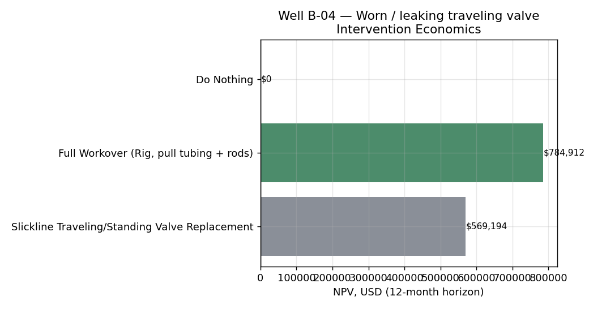
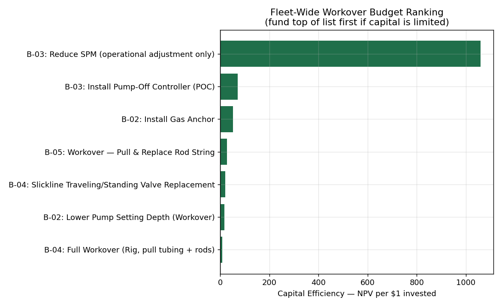
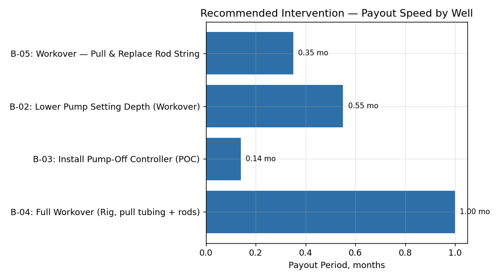
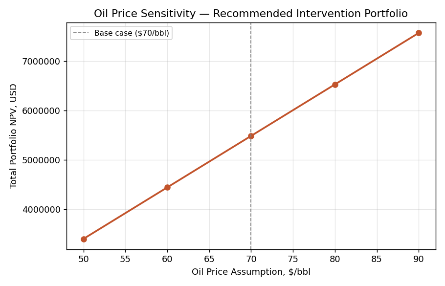

# Well Intervention Candidate Selection & Economic Decision Case

**Author:** David Damanik
**Project type:** Independent portfolio case study (synthetic field data, real economic decision framework)
**Tools:** Python (NumPy, Matplotlib) — discounted cashflow economics, capital allocation ranking

---

## 1. Problem Statement

Project 2 (SRP Diagnostics) identified four wells with confirmed downhole problems and quantified how much production each is losing. That's a diagnosis — not a decision. This project answers the question a production engineer actually has to answer next:

**Given a limited workover budget, which interventions should be funded, in what order, and how confident should we be in that recommendation?**

This is also where the field experience behind this portfolio connects directly: the slickline operations (RIH gauge cutter, lead impression block, SSD/TRSV function testing) done during the Petrol Pratama Energi internship are the same category of job evaluated here as a genuine low-cost intervention option, not just a field task performed on someone else's instruction.

## 2. Input Data (carried forward from Project 2)

| Well | Diagnosis | Lost Production |
|---|---|---|
| B-05 | Parted rod / stuck pump (mechanical failure) | 178.8 bopd |
| B-02 | Gas interference | 99.0 bopd |
| B-03 | Fluid pound (pump-off / low fluid level) | 93.1 bopd |
| B-04 | Worn / leaking traveling valve | 58.1 bopd |

*(A-01 and B-06 are excluded — Project 2 diagnosed both as normal operation, so no intervention is evaluated.)*

## 3. Candidate Interventions & Economic Assumptions

For each diagnosis, 2–3 realistic intervention options were defined with planning-level cost, duration, expected recovery fraction (of the lost production), and success probability (technical/mechanical risk of the job not achieving its target):

| Diagnosis | Options considered |
|---|---|
| Parted rod (mechanical failure) | Full workover (rod replacement) / Do nothing |
| Gas interference | Install gas anchor / Lower pump setting depth (workover) / Do nothing |
| Fluid pound | Install pump-off controller / Reduce SPM (no cost) / Do nothing |
| Worn traveling valve | **Slickline valve replacement** / Full workover / Do nothing |

**Economic assumptions:** oil price $70/bbl, variable lifting cost $15/bbl (→ $55/bbl contribution margin), 10%/yr discount rate, 2%/month decline applied to the incremental rate, 12-month evaluation horizon. Job cost is charged in full regardless of outcome; revenue is probability-weighted by the job's success probability. *These are stated planning assumptions, not vendor quotes — see Limitations.*

## 4. Results — Recommended Intervention per Well

| Well | Recommended | NPV (12-mo) | Payout | ROI |
|---|---|---|---|---|
| B-05 | Workover — Pull & Replace Rod String | **$2,696,671** | 0.35 mo | 2,839% |
| B-02 | Lower Pump Setting Depth (Workover) | **$1,156,112** | 0.55 mo | 1,779% |
| B-03 | Install Pump-Off Controller (POC) | **$849,254** | 0.14 mo | 7,077% |
| B-04 | Full Workover (Rig, pull tubing + rods) | **$784,912** | 1.0 mo | 923% |

*Note on scale: these figures look large relative to job cost because the underlying wells are losing 58–179 bopd — at a $55/bbl margin, that is $3,200–$9,800/day of foregone revenue, so even a $500 operational fix (see B-03 "Reduce SPM") shows an extreme ROI. This is a real, well-documented feature of low-cost production optimization work, not a modeling error — see Limitations for what these figures exclude.*

## 5. A Key Nuance — NPV-Maximizing vs. Capital-Efficient Choice (Well B-04)

Well B-04 is the most interesting case in this study. Two very different-looking jobs are both economically attractive:

- **Full workover** ($85,000): higher recovery (95%) and higher success probability (92%) → **higher absolute NPV ($784,912)**
- **Slickline valve replacement** ($28,000): lower recovery (75%) and success probability (80%), but far lower cost → **higher capital efficiency (NPV of $20.33 per $1 spent, vs. $9.23 for the full workover)**

**If capital is unconstrained, fund the full workover. If the workover budget is limited and being spread across multiple wells, the slickline job is the better use of each dollar.** This is exactly the kind of trade-off a production engineer is expected to flag to management rather than silently picking one — it also reflects genuine field logic: slickline is faster, cheaper, and lower-risk to mobilize than a full rig workover, which is why it's usually tried first in practice.

## 6. Fleet-Wide Capital Allocation Ranking

Ranking every candidate option (across all 4 wells) by **capital efficiency** — not diagnosis severity — gives a funding order for a constrained workover budget:

1. **B-03: Reduce SPM** ($500) — essentially free, immediate
2. **B-03: Install POC** ($12,000)
3. **B-02: Install Gas Anchor** ($15,000)
4. **B-05: Workover — Rod Replacement** ($95,000)
5. **B-04: Slickline Valve Replacement** ($28,000)
6. **B-02: Lower Pump Setting Depth** ($65,000)
7. **B-04: Full Workover** ($85,000)

Total cost to fund the entire ranked list: **$300,500**. If the available budget is smaller — for example if only $150,000 is available this quarter — this ranking says fund items 1–5 ($150,500) rather than jumping straight to the most severe-looking diagnosis (B-05) alone.

**Payout speed** reinforces the same story — every recommended job pays back in under 5 weeks even before accounting for the full 12-month production benefit:

## 7. Oil Price Sensitivity

The recommended portfolio's total NPV was tested from $50–90/bbl. Even at $50/bbl — a materially bearish scenario — the portfolio remains strongly NPV-positive (**$3.4M**), confirming the recommendation is not a price-assumption artifact.

## 8. Recommendations

1. **Fund the ranked list in order (§6) if capital is constrained**, rather than by diagnosis severity alone — B-05 is the worst-looking problem, but three cheaper jobs on other wells deliver more NPV per dollar.
2. **On B-04 specifically, escalate the trade-off decision** (full workover vs. slickline) rather than defaulting to the larger job — this is a genuine judgment call worth a short memo to a supervisor.
3. **B-03's "Reduce SPM" option should be executed immediately regardless of budget cycle** — it is a zero-capital operational change with same-week payback.
4. **Re-run this model with actual vendor quotes and a company price deck** before it drives real capital allocation — the framework is sound, the specific dollar figures are planning-level assumptions.

## 9. Limitations & Next Steps

- Cost, duration, recovery fraction, and success probability are stated planning-level assumptions, not vendor quotes or historical job performance data.
- NPV figures represent **contribution margin only** — they exclude royalties, taxes, fixed field overhead, and rig/crew availability constraints, all of which would reduce the figures in a full corporate economic evaluation.
- The evaluation horizon is fixed at 12 months; a longer horizon would further favor higher-recovery, higher-cost options like full workovers.
- Success probabilities are single-point estimates; a natural extension is a Monte Carlo simulation over cost, recovery fraction, and success probability distributions to produce a P10/P50/P90 NPV range instead of a single number.
- This project deliberately does not re-diagnose the wells — it assumes Project 2's diagnosis is correct. A real workflow would sanity-check the diagnosis against additional data (well test, fluid shot) before committing capital.
