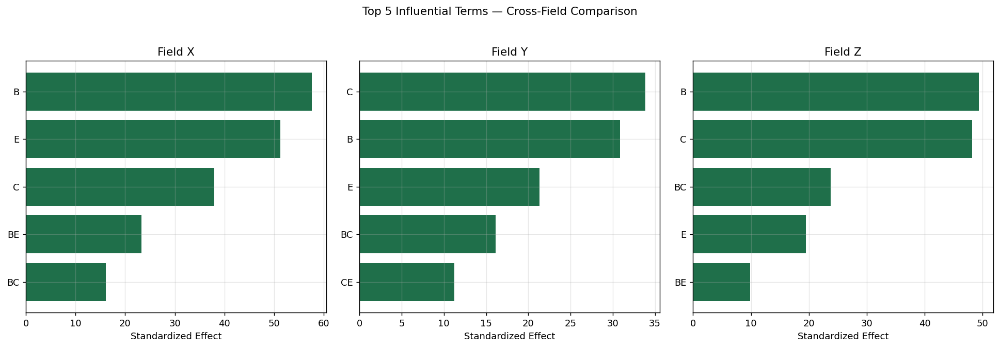
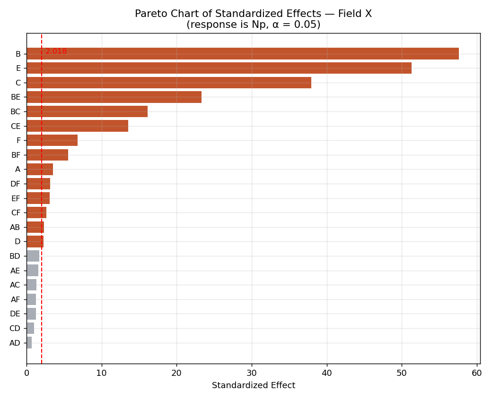
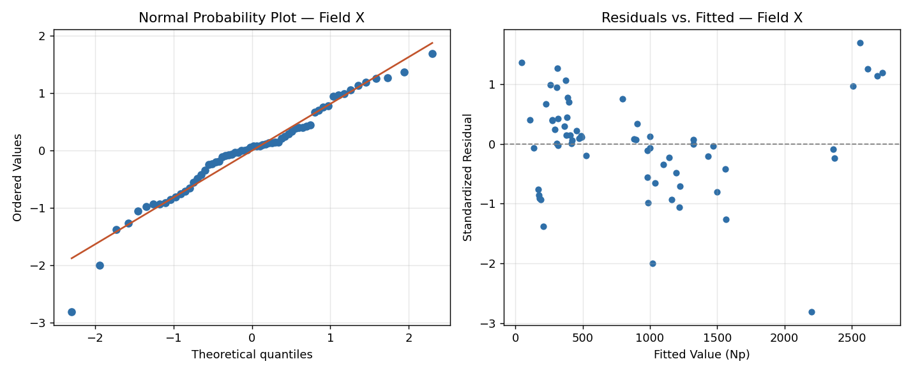
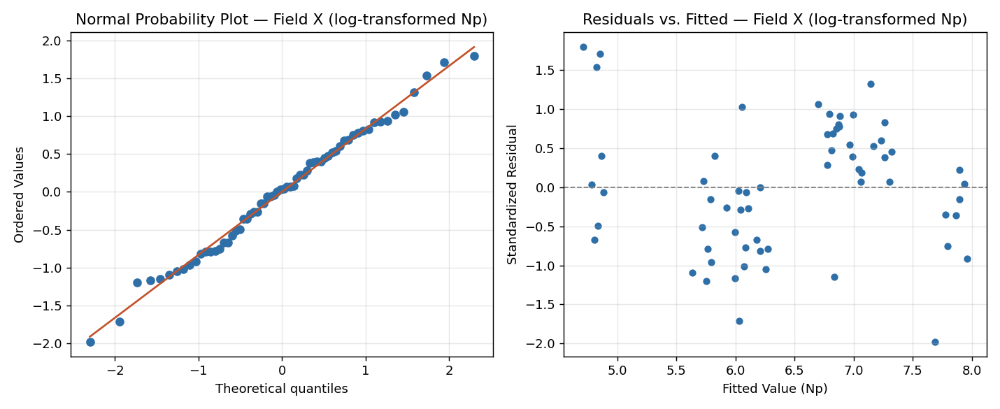

# CO2-EOR Sensitivity Analysis via Design of Experiments — Portfolio Reproduction & Extension

**Author:** David Damanik
**Project type:** Portfolio reproduction of undergraduate thesis research, rebuilt independently in Python from raw experimental data
**Original thesis:** *"Seeking the Influencing Parameters on CO2-EOR Projects through Sensitivity Analysis using Design of Experiment"* — Bachelor Thesis, Institut Teknologi Bandung, 2025 (Adviser: Prof. Ir. Tutuka Ariadji, M.Sc., Ph.D.)
**Tools:** Python (NumPy, Pandas, SciPy, Matplotlib) — orthogonal factorial design analysis, effect estimation, residual diagnostics

---

## 1. What This Project Is

The original thesis used **EORgui** (a CO₂PM-based predictive simulator) to run a Two-Level Full Factorial (2⁶) Design of Experiments across three geologically distinct Indonesian oil fields, then analyzed the results in **Minitab**. This project independently reproduces that entire statistical analysis **from scratch in Python**, using only the raw 64-run simulation output tables from the thesis (no Minitab, no proprietary software) — and then extends it with an honest, data-only remedy for the model validity problem the thesis identified but did not resolve.

This matters for two reasons: it demonstrates the statistical methodology can be rebuilt independently of the specific software used, and it shows the reproduction is faithful enough to trust extending it further.

## 2. Problem Statement

With Indonesia's mature oil fields needing CO₂-EOR to sustain production, three fields with different depositional environments — **Field X** (carbonate), **Field Y** (fluvial sandstone), **Field Z** (deltaic sandstone) — were evaluated to answer:

1. Which reservoir/production parameters most influence CO₂-EOR recovery (Np), and is that answer consistent across different geological settings?
2. Is the resulting statistical model actually valid for quantitative prediction, or only for screening/ranking?

## 3. Methodology

### 3.1 Design
Six parameters (Initial Oil Cut, Pattern Area, Porosity, Permeability, Thickness, Dykstra-Parsons Coefficient) were each tested at a Low and High level in a full 2⁶ factorial design — **64 simulation runs per field**, no replicates.

### 3.2 Reproducing the statistical analysis independently
Rather than trusting the thesis's narrative "Low/Medium/High" tables at face value, the actual factor levels used in each run were **derived directly from the raw data** (empirical min/max per column). This caught a real, honest detail: for a few factors/fields (e.g. Field Y's Thickness and D-P Coefficient), the levels actually run sit slightly closer to the thesis's reported "Medium" value than its "High" value — a normal occurrence in real experimental work, and the correct move is to verify against the raw run matrix rather than the narrative text.

With factors coded to ±1, the design is exactly orthogonal, so effect estimates have a closed-form solution. Effects for **3-way and higher-order interactions (42 of the 63 possible terms) were pooled as an estimate of pure error** — the standard approach for an unreplicated factorial — giving 42 error degrees of freedom and a significance threshold of **t = 2.018** (α = 0.05), matching the thesis's reported "2.02" threshold exactly.

### 3.3 Validation of the reproduction
Before trusting any extension of this analysis, the reproduction was checked against the thesis's own reported numbers:

| Field | Reported (thesis) | Reproduced (this project) |
|---|---|---|
| X — top effect (B) | ≈57 | **57.58** |
| X — 2nd (E) | ≈51 | **51.27** |
| Y — top effect (C) | ≈34 | **33.87** |
| Z — top effect (B) | ≈49 | **49.37** |
| Z — 2nd (C) | ≈48 | **48.18** |

The reproduced Pareto ranking order matches the thesis figures term-for-term for all three fields. This is a genuine independent confirmation of the original result, not a re-statement of it.

## 4. Results — Influential Parameters (Reproduced)

Consistent with the thesis, **volumetric parameters dominate regardless of depositional environment**:

| Field | Top 5 (standardized effect) |
|---|---|
| X (carbonate) | B=57.6, E=51.3, C=37.9, BE=23.3, BC=16.1 |
| Y (fluvial sandstone) | C=33.9, B=30.9, E=21.3, BC=16.1, CE=11.3 |
| Z (deltaic sandstone) | B=49.4, C=48.2, BC=23.7, E=19.5, BE=9.8 |

*(B = Pattern Area, C = Porosity, E = Thickness)*

Pattern Area, Porosity, and Thickness — and their two-way interactions — are the top drivers in every field, confirming the thesis's central conclusion: **the total reservoir volume contacted by CO₂ dominates recovery prediction in this model, more than permeability or the initial fluid ratio.**

## 5. Model Validity — Reproducing the Residual Problem

The residual diagnostics reproduce the exact problem the thesis flagged: a systematic **"S-curve" deviation** in the normal probability plot, and a **funnel-shaped spread** in residuals vs. fitted values (variance growing with predicted Np). This confirms the linear model, despite correctly ranking which parameters matter, is not statistically valid for precise quantitative prediction — exactly as concluded in the original thesis.

## 6. Extension — Testing a Data-Only Remedy

The thesis recommended **Response Surface Methodology (RSM)** as future work to fix this. That recommendation is correct, but a full RSM (e.g. a Central Composite Design) **cannot be fit with the existing dataset** — a 2-level factorial has no center or axial points, so curvature (x² terms) is mathematically inestimable from this data alone. Fitting a "fake" RSM here would misrepresent what a 2-level design can support, and running new simulations was outside this project's scope (no access to EORgui).

Instead, this project tests the one legitimate, **data-only** remedy available: a **log transformation of Np**, re-fitting the identical model. A funnel-shaped residual pattern is the textbook signature for exactly this kind of variance-stabilizing transform.

### Results — did it work?

| Field | Variance ratio (raw → log) | Shapiro-Wilk normality p-value (raw → log) |
|---|---|---|
| X | 11.53 → **3.34** | 0.068 → **0.900** |
| Y | 5.66 → 5.53 (no improvement) | 0.022 → 0.00002 (**worse**) |
| Z | 8.85 → **1.20** | 0.124 → **0.608** |

**The transform substantially fixes Fields X and Z** — variance ratio drops close to 1 (constant variance) and normality is restored (p > 0.05, versus previously borderline/failing). Field X's residual plots (above) show the difference visually: the funnel is gone and the normal probability plot tightens to the reference line.

**Field Y does not respond to the same remedy** — variance ratio barely moves, and normality actually gets worse. This is a genuinely useful negative result: it suggests Field Y's non-linearity has a different source than the multiplicative-error pattern a log transform corrects for, and **reinforces rather than replaces** the thesis's original recommendation — Field Y specifically needs a true RSM/CCD study with new simulation runs, while X and Z's prediction accuracy can likely be meaningfully improved today with a simple transform, no new simulations required.

## 7. Conclusions

1. **The reproduction independently confirms the thesis's central finding**: Pattern Area, Porosity, and Thickness (and their interactions) are the dominant drivers of CO₂-EOR recovery across all three geological settings, with standardized effects matching the original Minitab analysis closely enough to consider this a validated, software-independent replication.
2. **The residual/model-validity problem is real and reproducible** — not an artifact of the original software or analysis choices.
3. **A log transform is a legitimate, low-cost first step** that resolves the issue for Fields X and Z without requiring new simulation runs, and should be considered before committing to a full new RSM study for those fields.
4. **Field Y specifically requires the originally recommended RSM/CCD approach** — the transform-based evidence here strengthens the case that its non-linearity is structurally different from X and Z, giving a more targeted next step than the original "run RSM on everything" recommendation.
  
## 8. Limitations

- This project reproduces the *statistical analysis* independently; it does not re-run the underlying EORgui/CO₂PM reservoir simulations — the raw Np values are taken directly from the thesis's reported run matrix.
- The log-transform remedy is a legitimate variance-stabilization technique, but it does not replace a true RSM/CCD study where curvature needs to be *quantified* (e.g. for optimization), only where the *existing linear ranking* needs more trustworthy residual behavior.
- Six-way saturated model + higher-order-interaction error pooling assumes those higher-order interactions are genuinely negligible; this is a standard assumption for unreplicated factorials but not independently testable without true replicates.
